# staff-db

## DB・テーブル構成

```mermaid
erDiagram
    %% --------------------
    %% 1. 職員の基本情報
    %% --------------------
    Users {
        VARCHAR user_id PK "管理ID (PK)"
        VARCHAR name "氏名"
        DATE birthday "生年月日"
        DATE hire_date "入職日"
        VARCHAR personal_extension_number "個人の内線"
        TIMESTAMP updated_at "最終更新日時"
    }

    User_Statuses {
        INTEGER status_id PK "ステータスID (PK)"
        VARCHAR status_name "ステータス名"
        TIMESTAMP updated_at "最終更新日時"
    }

    User_Status_History {
        INTEGER status_history_id PK "履歴ID (PK)"
        VARCHAR user_id FK "管理ID (FK)"
        INTEGER status_id FK "ステータスID (FK)"
        DATE start_date "開始日"
        DATE end_date "終了日"
        TIMESTAMP updated_at "最終更新日時"
    }

    %% --------------------
    %% 2. 各種ID管理
    %% --------------------
    Employee_Number_History {
        INTEGER employee_number_history_id PK "履歴ID (PK)"
        VARCHAR user_id FK "管理ID (FK)"
        VARCHAR employee_number "職員番号"
        INTEGER position_id FK "職位ID (FK)"
        DATE start_date "開始日"
        DATE end_date "終了日"
        TIMESTAMP updated_at "最終更新日時"
    }

    Positions {
        INTEGER position_id PK "職位ID (PK)"
        VARCHAR position_name "職位名"
        TIMESTAMP updated_at "最終更新日時"
    }

    D_Number_History {
        INTEGER d_number_history_id PK "履歴ID (PK)"
        VARCHAR user_id FK "管理ID (FK)"
        VARCHAR d_number "D番号"
        DATE start_date "開始日"
        DATE end_date "終了日"
        TIMESTAMP updated_at "最終更新日時"
    }

    System_IDs {
        INTEGER system_id_record_id PK "レコードID (PK)"
        VARCHAR user_id FK "管理ID (FK)"
        VARCHAR system_id "情報システムID"
        BOOLEAN is_active "有効フラグ"
        TIMESTAMP updated_at "最終更新日時"
    }

    Cards {
        VARCHAR card_uid PK "カードUID (PK)"
        VARCHAR user_id FK "管理ID (FK)"
        VARCHAR card_management_id "カード管理用ID"
        BOOLEAN is_active "有効フラグ"
        TIMESTAMP updated_at "最終更新日時"
    }

    %% --------------------
    %% 3. 部署・所属管理
    %% --------------------
    Departments {
        INTEGER department_id PK "部署ID (PK)"
        VARCHAR department_extension_number "部署の内線"
        DATE create_date "設立日"
        TIMESTAMP updated_at "最終更新日時"
    }

    Department_Name_History {
        INTEGER dept_name_history_id PK "履歴ID (PK)"
        INTEGER department_id FK "部署ID (FK)"
        VARCHAR department_name "部署名"
        DATE start_date "開始日"
        DATE end_date "終了日"
        TIMESTAMP updated_at "最終更新日時"
    }

   %% --- 中間テーブル ---
    User_Departments {
        VARCHAR user_id PK, FK "管理ID (PK, FK)"
        INTEGER department_id PK, FK "部署ID (PK, FK)"
        TIMESTAMP updated_at "最終更新日時"
    }

    %% --------------------
    %% 4. システム連携
    %% --------------------
    External_Systems {
        INTEGER system_id PK "システムID (PK)"
        VARCHAR system_name "外部システム名"
        DATE start_date "開始日"
        DATE end_date "終了日"
        TIMESTAMP updated_at "最終更新日時"
    }

    External_System_Exports {
        INTEGER export_setting_id PK "設定ID (PK)"
        INTEGER system_id FK "システムID (FK)"
        VARCHAR table_name "対象テーブル名"
        VARCHAR column_name "対象カラム名"
        TIMESTAMP updated_at "最終更新日時"
    }

    %% --- 関係性の定義 ---
    Users ||--o{ User_Status_History : "のステータス履歴"
    User_Statuses ||--o{ User_Status_History : "が割り当てられる"

    Users ||--o{ Employee_Number_History : "が持つ"
    Positions ||--o{ Employee_Number_History : "が割り当てられる"

    Users ||--o{ D_Number_History : "が持つ"
    Users ||--o{ System_IDs : "が持つ"
    Users ||--o{ Cards : "の所持カード"

    Users ||--o{ User_Departments : "の所属"
    Departments ||--o{ User_Departments : "の所属者"
    Departments ||--o{ Department_Name_History : "の名称履歴"

    External_Systems ||--o{ External_System_Exports : "の連携設定"
```




## ディレクトリ構成

```
project/
├── compose.yaml                 # 本番用（ベース定義）
├── compose.override.yaml        # 開発用オーバーライド
├── frontend/
│   ├── Dockerfile               # 本番用
│   ├── Dockerfile.dev           # 開発用
│   └── nginx.conf               # 本番用
│   └── nginx.dev.conf           # 開発用
├── backend/
│   └── Dockerfile
```


## 概念図

### 開発モード

```
                   ┌─────────────────┐
   Browser         │     Nginx       │  (公開:80)
 http://localhost  │ (reverse proxy) │
──────────────────▶│  / → frontend   │──▶ React Dev Server (3000)
                   │ /api → backend  │──▶ Flask (5000)
                   └─────────────────┘
                                │
                                ▼
                           MySQL (3306)

【外部からアクセス可能】
- Nginx (80) のみ

【コンテナ間通信】
- Nginx → frontend:3000
- Nginx → backend:5000
- backend → db:3306
```

### 本番モード

```
                   ┌──────────────────┐
   Browser         │  Nginx(frontend) │  (公開:80)
 http://localhost  │------------------│
──────────────────▶│  / → React build │ (静的配信)
                   │ /api → backend   │──▶ Flask (5000)
                   └──────────────────┘
                                │
                                ▼
                           MySQL (3306)

【外部からアクセス可能】
- Nginx (80) のみ

【コンテナ間通信】
- Nginx → backend:5000
- backend → db:3306
```


## 疎通確認

### 開発モード（compose.yaml + compose.override.yaml）

```bash
docker compose -f compose.yaml -f compose.override.yaml up --build
```

チェック項目

1. Nginx が立ち上がるか
   - ブラウザで http://localhost/ を開く
   - React Dev Server のページが表示されるか確認
   - ページを編集して保存するとホットリロードされるか確認
2. フロントエンド → バックエンド（API）通信
   - http://localhost/api/health のような簡単なエンドポイントを Flask に実装して確認
     200 OK が返ってくれば疎通成功
3. バックエンド → DB 通信
   - Flask 側から MySQL に接続してクエリを実行できるか確認
     例：SELECT 1; を叩いて正常応答をログで確認
4. ネットワークの制限確認
   - http://localhost:5000 → アクセスできないことを確認（外部公開していないため）
   - http://localhost:3306 → アクセスできないことを確認

### 本番モード（compose.yaml 単体）

```bash
docker compose up --build
```

1. Nginx が立ち上がるか
   - ブラウザで http://localhost/ を開く
   - React ビルド済みの静的ページが表示されることを確認
2. フロントエンド → バックエンド（API）通信
   - ブラウザまたは curl で http://localhost/api/health
     200 OK が返ってくれば疎通成功
3. バックエンド → DB 通信
   - Flask 側から MySQL に接続してテーブル一覧を取得できるか確認
   - アプリのログでエラーが出ていないかチェック
4. ネットワークの制限確認
   - http://localhost:5000 → アクセスできないことを確認
   - http://localhost:3306 → アクセスできないことを確認